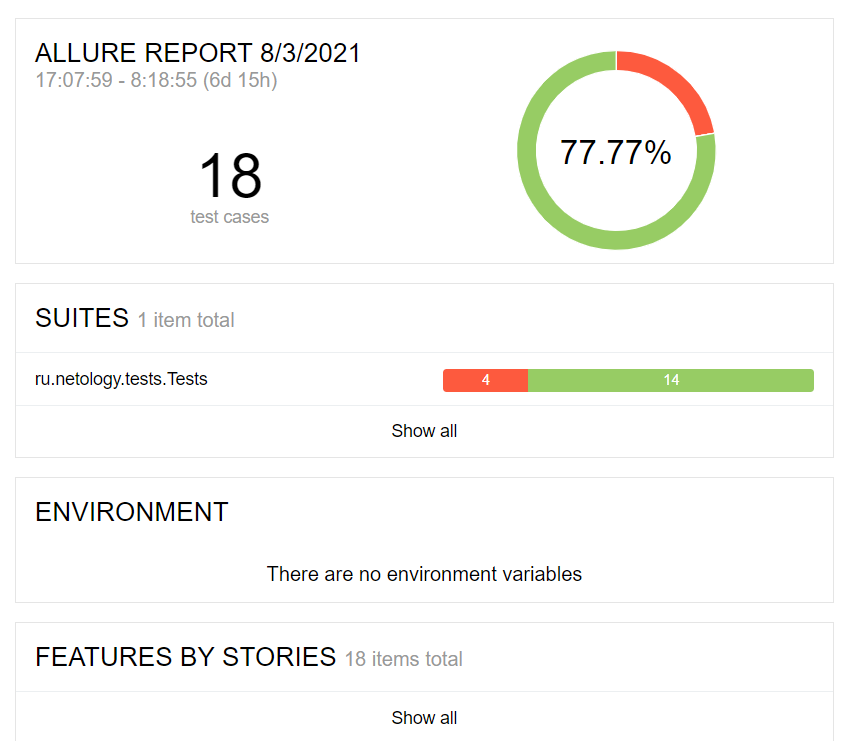

### Отчет по итогам автоматизированного тестирования

Приложение было протестировано согласно составленным [позитивным и негативным сценариям](/documentation/Plan.md)

В итоге было написано 18 тест-кейсов (4 на базы данных/14 на UI приложения).
Allure Reporter показывает 77.77% успешных тестов.

В процессе автоматизированного тестирования было найдено 4 бага.Еще 4 бага было найдено в процессе ручного тестирования.На все баги были оформлены [багрепорты](https://github.com/jukkty/Diploma/issues)

Приложение нуждается в исправлении найденных багов. Выпускать такое приложение нельзя
